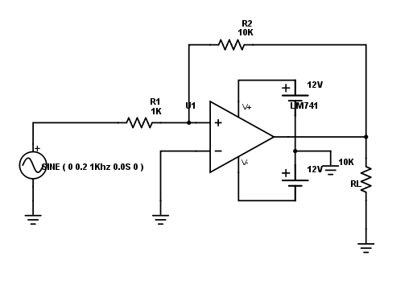
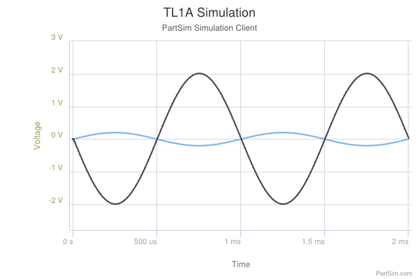
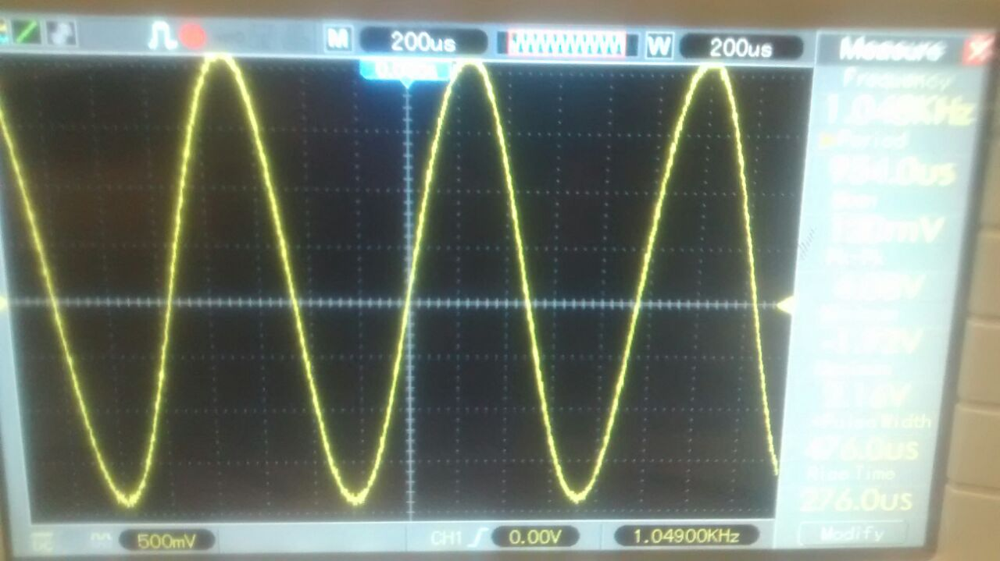
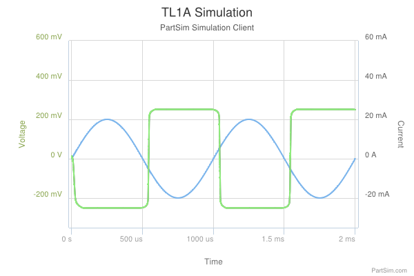

*Objetivo: Presentar a través de mediciones en laboratorio, la utilización de circuitos integrados analógicos y componentes asociados para la realización de distintas funciones. Observar las limitaciones que presenta el uso de los modelos representativos del funcionamiento de dichos circuitos integrados para predecir su comportamiento, como así también la influencia de las características del instrumental utilizado en la medición, en los valores obtenidos.*

#A) Amplificador de tensión o multiplicador por una constante

Se comienza el trabajo con la medición de un amplificador en configuración de multiplicador por una constante. Según el caso ideal se espera que $v_o=-R_2/R_1 . v_i$. 

##1.  

###a)	$R_1 = 1K\Omega$ y $R_2 = 10 K\Omega$
		
\hfill

El calculo teórico nos da que $v_o/v_i=-10$

####Simulación

\hfill

En la simulación se ve una salida similar a lo previsto por el modelo ideal. Con una señal de salida 10 veces mayor a la señal de entrada.

#### Medición

\hfill

con $$\hat{V}_i = 0.2V$$

medimos $$\hat{V}_o = 2V$$

que es consistente con los simulado.

\hfill

*Reemplazar $R_L$ por una resistencia de $10\Omega$*

En este caso se ve que la señal se recorta. Viendo la simulación de corriente por la resistencia de carga se ve que circulan por ella $25mA$ lo cual coincide con $I_CS$. Se aleja del modelo ideal por no poder entregar más corriente que la de cortocircuito.

###b)  $R_1 = 1M\Omega$ y $R_2 = 10 M\Omega$
        
\hfill

$\hat{V}_o =$

\hfill
\hfill

*{sacar foto de la forma de onda}*

\hfill
\hfill

*{sacar foto de la forma de onda con la fuente de ruido y explicar qué es}*

\hfill
\hfill
\hfill
\hfill
\hfill

###c)  $R_1 = 1K\Omega$ y $R_2 = 1M\Omega$

\hfill
\hfill

$\hat{V}_o =$

\hfill
\hfill

*{sacar foto de la forma de onda}*

\hfill
\hfill

##2. Valor de tensión pico en vacío	($R_1 = 1K\Omega$, $R_2 = 10K\Omega$ y punta 10X)

|f(Hz)|$\hat{V}_O$|
|-----|-----------|
|0| |
|10| |
|10k | |
|100k | |
|1M | |
|10Meg | |
| | |
| | |
| | |
| | |

*recordar que una caida de 3db se da cuando estás en el %70,7 del valor inicial*

\hfill
\hfill

$V_c=$

\hfill
\hfill

con $V_i=0,4V$ 

\hfill
\hfill

*{sacar foto de la forma de onda distorcionada}*

\hfill
\hfill

#B) Circuito Integrador
señal de entrada cuadrada de $f = 1/10RC = 1kHz$ de A=0,2V, con $R_1=1K\Omega$ y $C_1 = 100 nF$

\hfill
\hfill
*{sacar foto con y sin la resistencia $R_2=10K\Omega$ en paralelo al capacitor
con punta 10x y 1x}*
\hfill
\hfill

#F) Circuitos Rectificadores

\hfill
\hfill

*{sacar foto de $v_o (t)$}*

\hfill
\hfill

$\hat{V}_o=$

$\bar{V}_o=$

\hfill
\hfill

Con un capacitor de 47uF en paralelo y una señal de $f=50Hz$ y A=5V

|$R_L(\Omega)$ | $V_{ripple(ef)}$ | $\bar{V}_o$ | $z\% $|
|-|-|-|-|
|$10K$| | | |
|$4,7K$ | | | |
|$1K$| | | |

## Image

This is **Dr. Strangelove**.

{ width=50% }

## Maths {#maths}

* Bayes theorem: $P(H|E) = \frac{P(E|H) P(H)}{P(E)}$
* $\sqrt{x^2-1}$ is a random formula.

## Tables

Markdown table:

| **Right** | Left | Default | Center |
|------:|:-----|---------|:------:|
|   12  |  12  |    12   |    12  |
|  123  |  123 |   123   |   123  |
|    1  |    1 |     1   |     1  |

  : Demonstration of pipe table syntax.

\begin{table}[h]
\begin{center}
\begin{tabular}{|l|l|}\hline
Age & Frequency \\ \hline
18--25  & 15 \\
26--35  & 33 \\
36--45  & 22 \\ \hline
\end{tabular}
\caption{Pure {\LaTeX} table}
\end{center}
\end{table}

## Links

* **Internal link**: link to [markup](#markup).
* **External link**: link to [Google](https://google.com).
