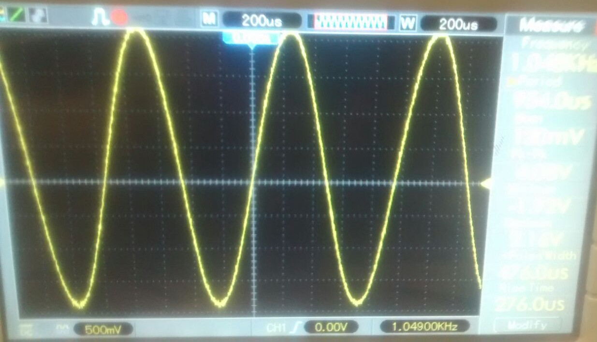
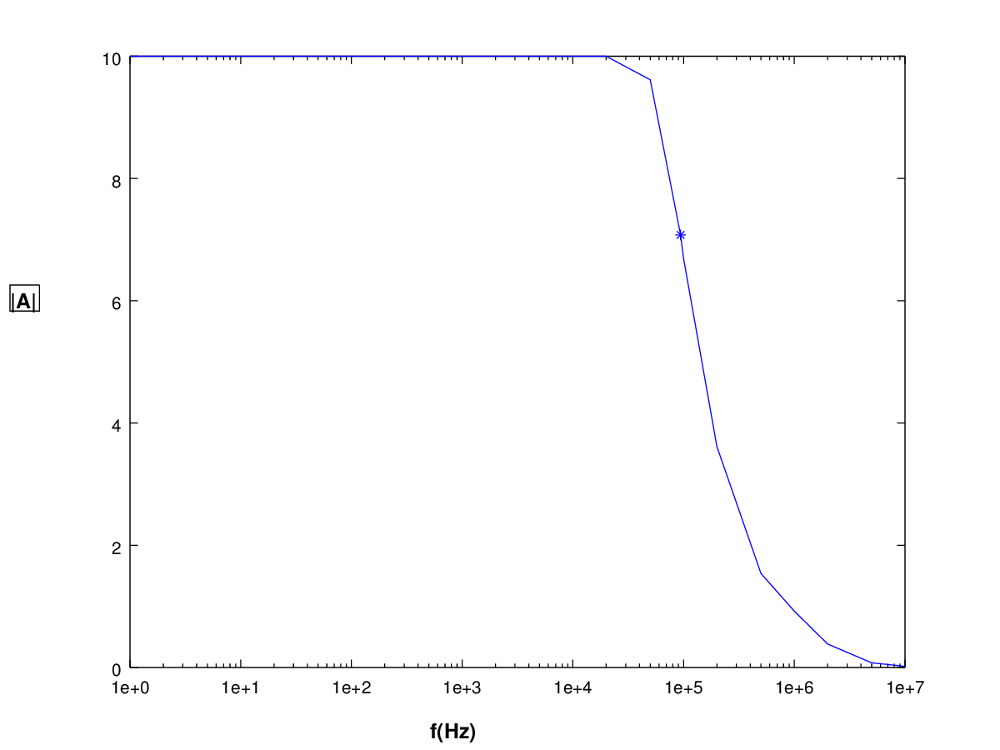
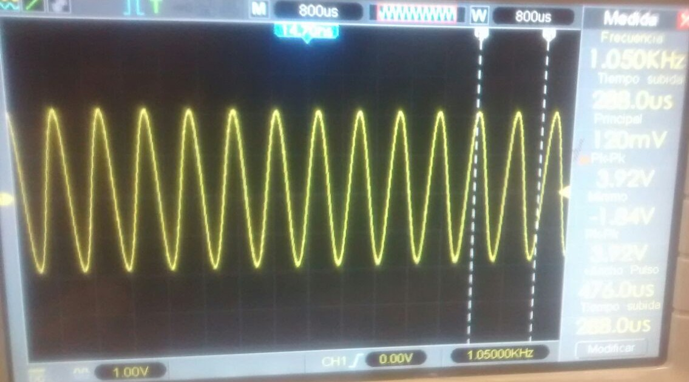

*Objetivo: Presentar a través de mediciones en laboratorio, la utilización de circuitos integrados analógicos y componentes asociados para la realización de distintas funciones. Observar las limitaciones que presenta el uso de los modelos representativos del funcionamiento de dichos circuitos integrados para predecir su comportamiento, como así también la influencia de las características del instrumental utilizado en la medición, en los valores obtenidos.*

#A) Amplificador de tensión o multiplicador por una constante

Se comienza el trabajo con la medición de un amplificador en configuración de multiplicador por una constante. Según el caso ideal se espera que $\displaystyle v_o=\frac{-R_2}{R_1}v_i$. 

##1. Obtener el valor de la tensión pico de salida del circuito y su forma de variación temporal para una entrada senoidal de $\SI {1}{\kilo\hertz}$ y $V_{i1} = \SI{0,2}{\volt}$, con los siguientes valores de $R_1$, $R_2$ : y $R_L = \SI{1}{\kilo\ohm}$. 

###a)	$R_1 = \SI{1}{\kilo \ohm}$ y $R_2 = \SI{10}{\kilo \ohm}$
		
\hfill

El calculo teórico nos da que $\displaystyle \frac{v_o}{v_i}=-10$

####Simulación

\hfill

En la simulación se ve una salida similar a lo previsto por el modelo ideal. Con una señal de salida 10 veces mayor a la señal de entrada.

#### Medición

\hfill

con $$\hat{V}_i = \SI{0,2}{\volt}$$

medimos $$\hat{V}_o = \SI{2}{\volt}$$

que es consistente con los simulado.

\hfill

*Reemplazar $R_L$ por una resistencia de $\SI{10}{\ohm}$*

En este caso se ve que la señal se recorta. Viendo la simulación de corriente por la resistencia de carga se ve que circulan por ella $\SI{25}{\milli \ampere}$ lo cual coincide con $I_CS$. Se aleja del modelo ideal por no poder entregar más corriente que la de cortocircuito.

###b)  $R_1 = 1\;\text{M}\Omega$ y $R_2 = 10\;\text{M}\Omega$

El calculo teórico nos da que $\displaystyle \frac{v_o}{v_i}=-2$
        
Al simular esta señal el software reportó errores de convergencia.

#### Medición

\hfill

$\hat{V}_o = 2\;\text{V}$

Se vio que la señal medida tiene mucho ruido, incluyendo una gran señal de ruido de 50Hz. Se especula que esto se debe a que al haber resistencias tan altas a la entrada(comparables con los $2M\Omega$ de entrada) cualquier fuente de ruido electromagnético se ve amplificada.

###c)  $R_1 = 1\;\text{k}\Omega$ y $R_2 = 1\;\text{M}\Omega$

\hfill

Se ve en este caso que la señal recorta por amplitud dado que las fuentes entregan sólo hasta $±12V$.

$\hat{V}_o =10.55\;\text{V}$

##2. Respuesta en frecuencia

###Simulación:

### Medición

Valor de tensión pico en vacío: $52\;\text{mV}$	($R_1 = 1\;\text{k}\Omega$, $R_2 = 10\;\text{k}\Omega$ y punta 10X).

|f(Hz)|  $\hat{V}_O$|
|-----|-------------|
|    1|        520mV|
|   10|        520mV|
|  100|        520mV|
|   1K|        520mV|
|  10K|        520mV|
|  20K|        520mV|
|  50K|        500mV| 
|  94K| 368mV($V_c$)|
| 100K|        348mV|
| 200K|        188mV|
| 500K|         80mV|
|   1M|         48mV|
|   2M|         20mV|
|   5M|          4mV|
|10Meg|          1mV|

Donde se ve que $f_c=94\;\text{kHz}$

Luego se pide ver qué pasa con $V_i=0,4\;\text{V}$ a 10\;\text{kHz}.

La explicación que encontramos a la distorción que observamos es que la velocidad de respuesta del amplificador es menor a la velocidad de cambio de la señal. En la hoja de datos se ve el parámetro ***Slew Rate*:** $0.5\frac{V}{\mu s}$

#B) Circuito Integrador

Trabajamos con una señal de entrada cuadrada de $\displaystyle f =\frac{1}{10RC} = 1\;\text{kHz}$ de A=0,2\;\text{V}, con $R_1=1\;\text{k}\Omega$ y $C_1 = 100 \;\text{nF}$

##Simulación

##Medición

#F) Circuitos Rectificadores

\hfill
\hfill

*{sacar foto de $v_o (t)$}*

\hfill
\hfill

$\hat{V}_o=$

$\bar{V}_o=$

\hfill
\hfill

Con un capacitor de 47uF en paralelo y una señal de $f=50Hz$ y A=5V

|$R_L(\Omega)$ | $V_{ripple(ef)}$ | $\bar{V}_o$ | $z\% $|
|-|-|-|-|
|$10K$| | | |
|$4,7K$ | | | |
|$1K$| | | |
