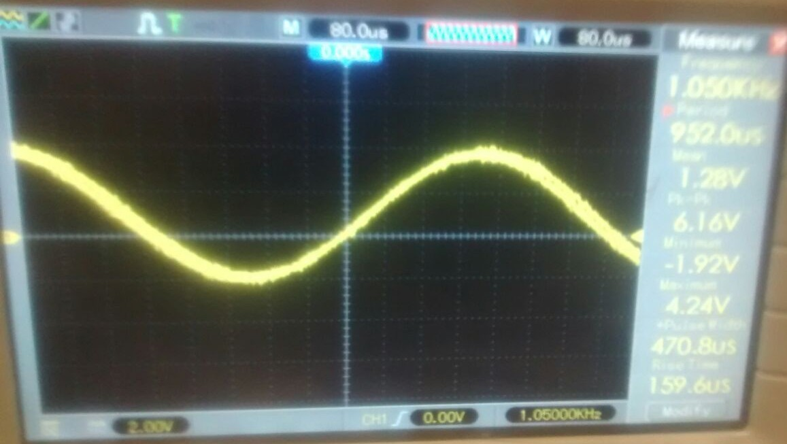
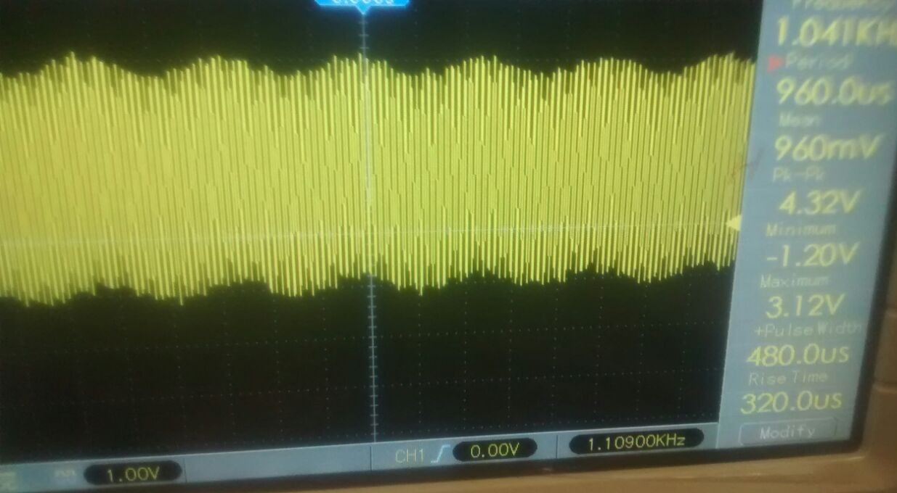
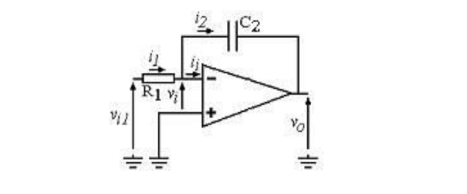
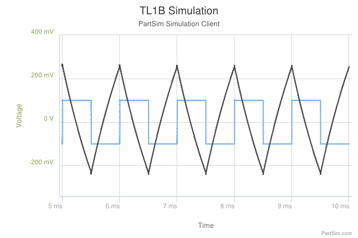

*Objetivo: Presentar a través de mediciones en laboratorio, la utilización de circuitos integrados analógicos y componentes asociados para la realización de distintas funciones. Observar las limitaciones que presenta el uso de los modelos representativos del funcionamiento de dichos circuitos integrados para predecir su comportamiento, como así también la influencia de las características del instrumental utilizado en la medición, en los valores obtenidos.*

#A) Amplificador de tensión o multiplicador por una constante

Se comienza el trabajo con la medición de un amplificador en configuración de multiplicador por una constante. Según el caso ideal se espera que $\displaystyle v_o=\frac{-R_2}{R_1}v_i$. 

##1. Obtener el valor de la tensión pico de salida del circuito y su forma de variación temporal para una entrada senoidal de $\SI {1}{\kilo\hertz}$ y $V_{i1} = \SI{0,2}{\volt}$, con los siguientes valores de $R_1$, $R_2$ : y $R_L = \SI{1}{\kilo\ohm}$. 

###a)	$R_1 = \SI{1}{\kilo \ohm}$ y $R_2 = \SI{10}{\kilo \ohm}$
		
\hfill

El calculo teórico nos da que $\displaystyle \frac{v_o}{v_i}=-10$ por lo que debería tener una salida de $\hat{V}_o = \SI{2}{\volt}$.

#### Simulación

\hfill

En la simulación se ve una salida similar a lo previsto por el modelo ideal. Con una señal de salida 10 veces mayor a la señal de entrada.

#### Medición

\hfill

Se usaron los 2 canales del osciloscopio para medir simultaneamente la señal de entrada y salida del operacional.

Usando una señal con $\hat{V}_i = \SI{0,2}{\volt}$ medimos $\hat{V}_o = \SI{2}{\volt}$.

Esto es consistente con los simulado. Además las señales de entrada y salida tenían un cambio de fase de $\pi$ radianes por el cambio de signo del amplificador.

\hfill

*Reemplazar $R_L$ por una resistencia de $\SI{10}{\ohm}$*

En este caso se ve que la señal se recorta. Viendo la simulación de corriente por la resistencia de carga se ve que circulan por ella $\SI{25}{\milli \ampere}$ lo cual coincide con $I_{CS}$. Se aleja del modelo ideal porque al no poder entregar más corriente que la de cortocircuito se **limita por corriente**.

### b)  $R_1 = \SI{1}{\mega \ohm}$ y $R_2 = \SI{10}{\mega\ohm}$

El calculo teórico nos da que $\displaystyle \frac{v_o}{v_i}=-10$ por lo que $\hat{V}_o = \SI{2}{\volt}$.
        
Al simular esta señal el software reportó errores de convergencia.

#### Medición

\hfill

$\hat{V}_o = \SI{2}{\volt}$

Se volvió a medir una señal de $\hat{V}_o = \SI{2}{\volt}$.

*Observar que en el caso b) su valor se aparta más que en a) del predicho por
el modelo ideal, al comenzar a influir el valor de la R i del AO.
Para el caso b), modificar la base de tiempo hasta determinar cuál es la fuen-
te de ruido que enmascara el valor útil a medir.*

Se vio que la señal medida tiene mucho ruido, incluyendo una gran señal de ruido de $\SI{50}{\hertz}$. Se especula que esto se debe a que al haber resistencias tan altas a la entrada(comparables con los $\SI{2}{\mega\ohm}$ de entrada) cualquier fuente de ruido electromagnético se ve amplificada.

###c)  $R_1 = \SI{1}{\kilo\ohm}$ y $R_2 = \SI{1}{\mega\ohm}$

\hfill

El calculo teórico nos da que $\displaystyle \frac{v_o}{v_i}=-1000$ por lo que $\hat{V}_o = \SI{2000}{\volt}$.

*Observar que en el caso c) es imposible amplificar la señal a los valores que
predice el modelo ideal, al alcanzarse los niveles de tensión máximos de fun-
cionamiento, determinados por los valores de las tensiones de alimentación.*

Se ve en este caso que la señal se *limita por tensión* dado que las fuentes de alimentación entregan sólo hasta $\pm\SI{12}{\volt}$.

$\hat{V}_o =\SI{10.55}{\volt}$

Tanto la simulación como la medición mostraron lo mismo. un recorte a una tensión límite de $\pm\SI{10,7}{\volt}$. La diferencia con lo que entrega la fuente la atribuimos a caidas de tensión en los elementos que componen el circuito interno del AO.

##2. Respuesta en frecuencia

###Simulación:

En la simulación se ve una $f_c = \SI{93,3}{\kilo\hertz}$.

### Medición

Valor de tensión pico en vacío: $\SI{52}{\milli\volt}$	($R_1 = \SI{1}{\kilo\ohm}$, $R_2 = \SI{10}{\kilo\ohm}$ y punta 10X).

|f                    |                  $\hat{V}_O$|
|---------------------|-----------------------------|
|       \SI{1}{\hertz}|        \SI{520}{\milli\volt}|
|      \SI{10}{\hertz}|        \SI{520}{\milli\volt}|
|     \SI{100}{\hertz}|        \SI{520}{\milli\volt}|
|  \SI{1}{\kilo\hertz}|        \SI{520}{\milli\volt}|
| \SI{10}{\kilo\hertz}|        \SI{520}{\milli\volt}|
| \SI{20}{\kilo\hertz}|        \SI{520}{\milli\volt}|
| \SI{50}{\kilo\hertz}|        \SI{500}{\milli\volt}| 
| \SI{94}{\kilo\hertz}| \SI{368}{\milli\volt}($V_c$)|
|\SI{100}{\kilo\hertz}|        \SI{348}{\milli\volt}|
|\SI{200}{\kilo\hertz}|        \SI{188}{\milli\volt}|
|\SI{500}{\kilo\hertz}|         \SI{80}{\milli\volt}|
|  \SI{1}{\mega\hertz}|         \SI{48}{\milli\volt}|
|  \SI{2}{\mega\hertz}|         \SI{20}{\milli\volt}|
|  \SI{5}{\mega\hertz}|          \SI{4}{\milli\volt}|
| \SI{10}{\mega\hertz}|          \SI{1}{\milli\volt}|

\hfill

Donde se ve que $f_c=\SI{94}{\kilo\hertz}$

*¿Se esperaría medir el mismo valor de $f_c$ , de utilizar la punta de prueba direc-
ta (1X)?. ¿Y si se mide con un tester digital?.*

Si se utilizara una punta de medición X1 no se esperarían distorsiones nuevas ya que el filtro que se introduce al conectar la punta tiene un ancho de banda de más de $\SI{1}{\mega\hertz}$.
Si se usara un multimetro digital, debería verificarse que el ancho de banda de operación del instrumento sea adecuado para 100kHz, el cual generalmente no es soportado para mediciones AC. Suponemos que los resultados obtenidos al medir con un tester digital no representarían de manera confiable el comportamiento del circuito medido.

*Aumentar la tensión de entrada a más de $\SI{0,4}{\volt}. Verificar que a partir de una
frecuencia dada, cambia la forma de la señal de salida. Es decir que para esos
niveles de tensión de entrada y frecuencia, el modelo del amplificador dejaría
de predecir correctamente la forma de la tensión de salida (Slew rate).*

Tanto al simular como al medir encontramos que para $\SI{100}{\kilo\hertz} la forma de onda de salida se asemeja más a una señal triangular que a la señal senoidal de la entrada.

La explicación que encontramos a la distorción que observamos es que la velocidad de respuesta del amplificador es menor a la velocidad de cambio de la señal. En la hoja de datos se ve el parámetro ***Slew Rate*:** $\SI[per-mode=fraction]{0.5}{\volt\per\micro\second}$ que indica la pendiente máxima que puede tener la salida del operacional.

#B) Circuito Integrador

**Observar la forma de la señal de salida y medir su tiempo de crecimiento si se aplica una señal de entrada cuadrada de $f = \frac{1}{10\tau}$ y amplitud de $\SI{0,2}{\volt}$, con $R_1 = \SI{1}{\kilo\ohm}$ y $C_1 = \SI{100}{\nano\farad}$. Comparar con la obtenida al considerar el AO ideal de la expresión:**
$$v_o=\frac{-1}{R_1 C_2}\int v_{i1} dt= \frac{-1}{\tau} \int v_{i1} dt$$ 

 Trabajamos con una señal de entrada cuadrada de $\displaystyle f =\frac{1}{10RC} = \SI{1}{\kilo\hertz}$ de A=\SI{0,2}{\volt}, con $R_1=\SI{1}{\kilo\ohm}$ y $C_1 = \SI{100 }{\nano\farad}$

##Simulación

*Observar que la integración se ve limitada por los niveles máximos de funcionamiento dados por las tensiones de alimentación. Agregar un resistor $R_2 =\SI{10}{\ohm}$ en paralelo con $C_2$ y observar que la descarga de $C_2$ a través de $R_2$ permite un funcionamiento cercano al predicho en el modelo ideal, evitando alcanzar los límites de niveles de tensión de funcionamiento.*

Se ve que al integrar la tensión de entrada con el más pequeño offset de continua la señal crece indefinidamente. Es por esta integración llega a un límite rápidamente al alcanzar la tensión de alimentación del operacional que limita por tensión. Poniendo $R_2$ se permite descargar esta acumulación y ver bien el comportamiento integrador 

##Medición

*Observar si hay diferencia al utilizar puntas de prueba directa (1X) y compensada (10X).*

Se vio al medir con base de tiempo en \SI{250}{\micro\second} que el tiempo de crecimiento es de aproximadamente \SI{500}{\micro\second} con ambas puntas.

#F) Circuitos Rectificadores

**El circuito rectificador de media onda, implementado con un diodo 1N4001/07 y un resistor $R_L = \SI{10}{\kilo\ohm}$, se conecta a un banco de medición como el indicado:**

{width=70%}

\hfill

##1. Excitación con una señal senoidal de 50Hz y 5V pico.

\hfill

\hfill

Como se observa en la simulación, en el período positivo de la señal el diodo conduce en directa replicando la curva disminuida en aproximadamente $\SI{0,7}{\volt}$, que es la tensión de activación.

**¿Por qué se utiliza una amplitud pico de 5V en la excitación y no de 50mV?.**

Para que el diodo funcione como rectificador la señal de excitación utilizada debe ser tal que el diodo pueda ser polarizado, de modo que en el semiciclo positivo se superen los $V_d = \SI{0,7}{\volt}$ pico y su funcionmiento sea en directa. Luego, en el semiciclo negativo no se supere la tensión de ruptura $V_r$. 
Bajo esas condiciones se puede afirmar que el diodo cumple con su función de rectificador, aproximándolo al comportamiento de una llave abierta o cerrada dependiendo de la tensión aplicada al diodo.

{width=40%}

**¿Qué forma de onda de $V_o$, valores extremos y medio se esperaría medir si se aumenta la
frecuencia de excitación a 50kHz?**

\hfill

\hfill

Como se observa a través de la simulación, al elevar la frecuencia en tres ordenes de magnitud nos encontramos con que en el semiciclo negativo de la señal, el diodo continua conduciendo como si estuviera en directa, copiando a la señal de entrada hasta la tercera parte del semiciclo (aproximadamente $\SI{4}{\micro\second}$). \
Esto se debe a que el período de la señal es menor al tiempo que demora el diodo de cambiar de estado de polarización, por ende queda una densidad de cargas que permite la conducción en inversa. \
De acuerdo con las hojas de datos del diodo 1N4001 a frecuencias como \SI{50}{\kilo\hertz} deben tenerse en cuenta los efectos capacitivos que se hacen notorios en el pico de tension negativo al momento en que cambia el modo de operación del diodo.

\hfill

##2. Agregado de un capacitor de \SI{47}{\micro\farad} en paralelo y una señal de \SI{50}{\hertz} y \SI{5}{\volt} pico

Exitando el circuito con una señal senoidal de frecuencia 50 Hz y amplitud 5 V pico.

\hfill
{width=40%}

###a) Meidición de Ripple variando la resistencia de carga.

Observar y medir la tensión de salida sobre $R_L$ , $V_o$ , su valor medio, la variación máxima de la tensión de salida (ripple) de $V_o$ , $v_{ripple} = \Delta V_o$ , y calcular el **z%** para los valores resistencia de carga $R_L$ : \SI{10}{\kilo\ohm}, \SI{4,7}{\kilo\ohm}, y \SI{1}{\kilo\ohm}.

Para comenzar simulamos cada uno de los casos indicados y los contrastamos con las señal medida.

**Simulaciones**

{width=70%}

A partir del circuito de simulción indicado, variando la resistencia de carga se obtuvieron las curvas simuladas.

**Mediciones**

\hfill

{width=80%}

{width=80%}

{width=80%}

\hfill

**Porcentaje de ripple o rizado**

A partir de las curvas obtenidas mediante la medición del ripple comparamos los siguientes parámetros, recordando la relación $Z=100\frac{V_o}{V_{ripple}}$.

$R_L=\SI{1}{\kilo\ohm}$, $V_o=\SI{3,06}{\volt}$, $V_{ripple}=\SI{1,02}{\volt}$, Z=33%

{width=70%}

$R_L=\SI{4,7}{\kilo\ohm}$, $V_o=\SI{3,9}{\volt}$, $V_{ripple}=\SI{286}{\milli\volt}$, Z=7,33%

{width=70%}

$R_L=\SI{10}{\kilo\ohm}$, $V_o=\SI{4,09}{\volt}$, $V_{ripple}=\SI{158}{\milli\volt}$, Z=3,86%

{width=70%}

###b) Construir la gráfica de $V_{o (medio)}= f(I_{o (medio)})$, llamada “característica de regulación”.

La característica de regulación indica la tensión de salida en función de la corriente entregada al circuito externo, de aquí se puede dimensionar si el circuito empleado como fuente puede o no ser utilizado para una carga determinada, esto es, según la corriente que demande el circuito externo se verificará en la característica de regulación si es posible entregarla para un determinado Vo. Además, haciendo el cociente V0/I0 queda indicado la resistencia equivalente que vería el circuito externo al conectar la fuente.  