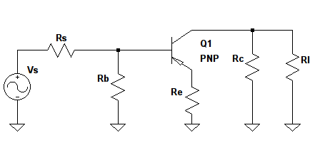
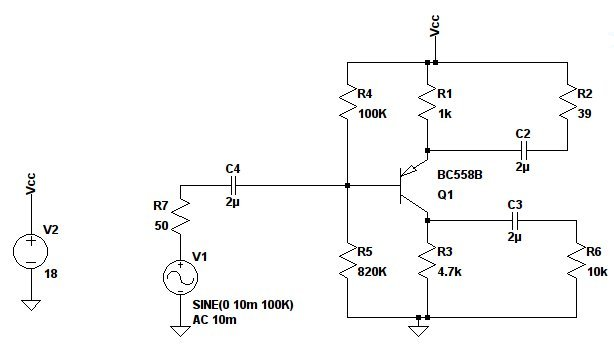
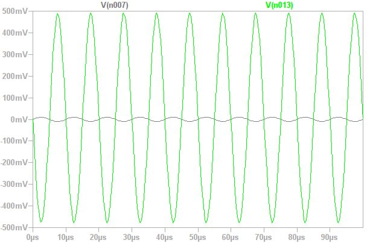
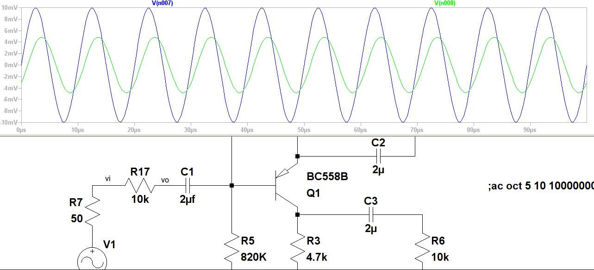
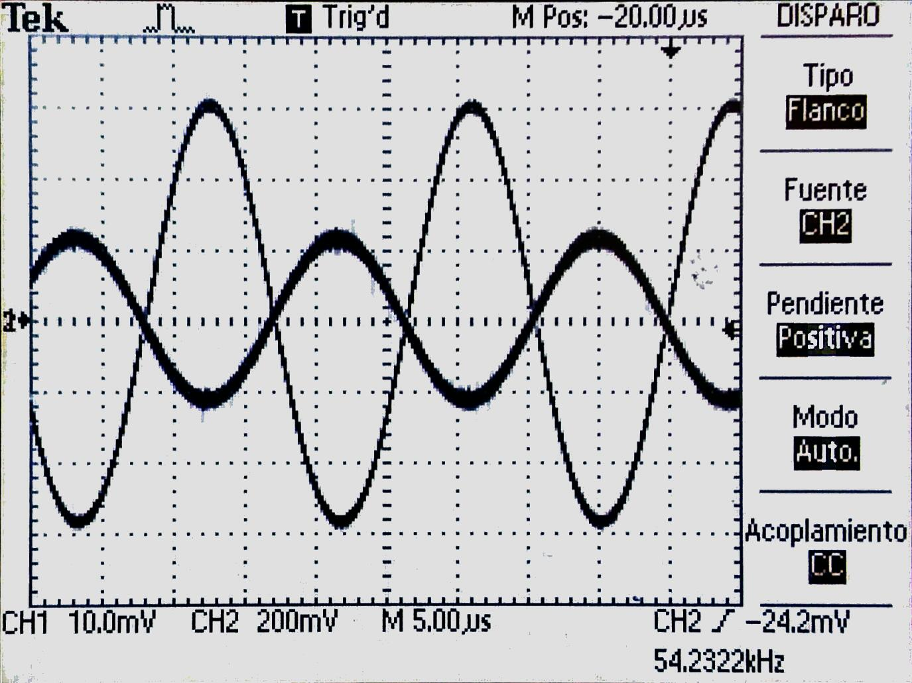
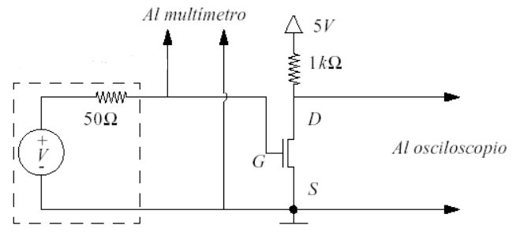
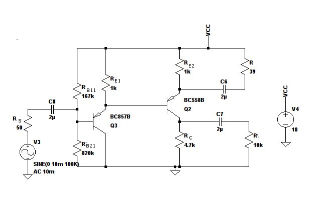
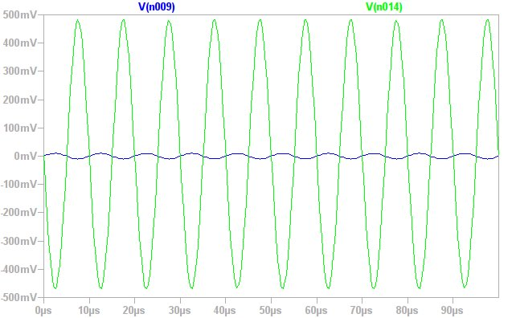
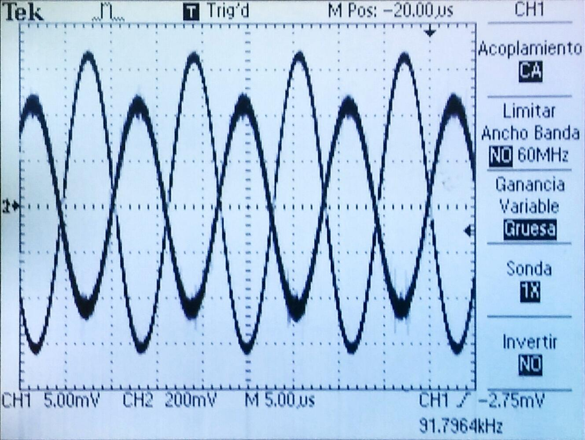

#Parte A) \underline{ETAPA AMPLIFICADORA CON UN TRANSISTOR}

Consigna:

> ***Obtenga una configuración que brinde $R_i > \SI{10}{\kilo\ohm}$, $A_v = \pm\SI{50}{\ohm}$ o lo más cercano posible. Trabajando con PNP.***

Viendo que se nos pide $A_v$ y $R_i$ elevados determinamos que nos conviene trabajar en modo emisor común.

Para tener $R_i$ elevado y mantener la amplificación estable a pesar de variaciones en $\beta$ decidimos tener una realimentación por emisor en señal.

Proponemos un circuito que en señal se vería como el siguiente:

{width=40%}

vemos que 

$$A_v = \frac{v_c}{v_b} = \frac{-g_m v_{be} R_C \parallel R_L}{v_b}= \frac{-g_m v_b \frac{r_\pi}{r_\pi+\beta R_E} (R_C \parallel R_L)}{v_b}=-\frac{g_m r_\pi (R_C \parallel R_L)}{r_\pi + \beta R_E} = -\frac{g_m (R_C \parallel R_L)}{1 + g_m R_E}$$

Y a la vez

$$ R_i = \frac{v_b}{i_b} = \frac{i_b R_\pi+i_e R_E}{i_b} = \frac{i_b(r_\pi + (\beta + 1)R_E)}{i_b} \sim r_\pi + \beta R_E $$

Con $I_{CQ} = \SI{1}{\milli \ampere}$ tenemos que $r_\pi= \frac{\beta V_T}{I_{CQ}}=\SI{7,5}{\kilo\ohm}$ así que con tener un $\beta R_E > \SI{2,5}{\kilo\ohm} \implies R_E > \frac{\SI{2,5}{\kilo\ohm}}{\beta}$ cumplimos la primera restricción.

Viendo la hoja de datos vemos que $\beta \sim 300$
$$R_E > \SI{8.33}{\ohm} $$

A la vez vemos de $A_v =- \frac{g_m (R_C \parallel R_L)}{1 + g_m R_E}$ que para tener un $|A_v|=50$ necestamos que $(R_C \parallel R_L)$ sea lo más grande posible para que pueda ser 50 veces más grande que $1 + g_m R_E$. 

Viendo los valores de capacidades disponibles en la placa nos quedamos con 
$$R_C=\SI{4.7}{\kilo\ohm}$$ 
y
$$R_L=\SI{10}{\kilo\ohm}$$

a la vez tenemos que $g_m=\frac{I_{CQ}}{V_T} = 0,04$ por lo que nos queda que 
$$|Av|=\frac{g_m(R_C \parallel R_L)}{1+g_m R_E} \implies R_E=\frac{(R_C \parallel R_L)}{50}-\frac{1}{g_m}=\SI{38,94}{\ohm}$$

Viendo la placa vimos que si bien no hay una resistencia tan baja hay la posibilidad de desacoplar parcialmente $R_E$ y utilizando un resistor externo. Decidimos hacer esto con un resistor de \SI{39}{\ohm} .

Esto nos deja con
$$R_i=\SI{19,2}{\kilo\ohm}$$

Pasamos a estudiar el circuito en continua.

{height=50%}

Con $I_{CQ}=\SI{1}{\milli\ampere}$ tenemos que $I_{BQ}=\frac{I_{CQ}}{\beta}=\SI{3,33}{\micro\ampere}$

Calculando los equivalentes de Thevenin de la red de polarización tengo que:

$$V_{B_{TH}}=V_{CC}\frac{R_{B1}}{R_{B1}+R_{B2}}$$
$$R_{B_{TH}}=\frac{R_{B1}R_{B2}}{R_{B1}+R_{B2}}$$

Viendo la malla de polarización:

$$V_{CC}-V_{B_{TH}}=I_{BQ} R_{B_{TH}}- V_{BE} +I_{EQ} R_E$$
$$V_{CC}-V_{B_{TH}}=I_{BQ} R_{B_{TH}}- V_{BE} +I_{EQ} R_E$$
$$V_{CC}-V_{B_{TH}}+V_{BE}=I_{BQ} R_{B_{TH}} +(\beta+1)I_{BQ} R_E$$
$$V_{CC}\bigg(1-\frac{R_{B2}}{R_{B1}+R_{B2}}\bigg)=I_{BQ}\bigg(\frac{R_{B1}R_{B2}}{R_{B1}+R_{B2}} +(\beta+1)R_E\bigg)-V_{BE}$$

Reemplazando los valores de $I_{CQ}$, $\beta$ y $V_{BE}$ y tomando $R_E=\SI{1}{\kilo\ohm}$ por ser el más alto y darnos mayor estabilidad llegamos a:

$$V_{CC}=\frac{R_{B1}+R_{B2}}{R_{B2}} \Bigg(\SI{3,33}{\micro\ampere} \big(\frac{R_{B1}R_{B2}}{R_{B1}+R_{B2}} +\SI{301}{\kilo\ohm})+\SI{0.7}{\volt}\Bigg)$$

Viendo la placa probamos primero con los valores más altos de $R_{B1}$ y $R_{B2}$:
 $$R_{B1}=\SI{820}{\kilo\ohm}$$ 
 $$R_{B2}=\SI{100}{\kilo\ohm}$$
que nos deja:
$$V_{CC}=\SI{18.39}{\volt}$$

Lo redondeamos a \SI{18}{\volt} la cual es una tensión de fuente nominal.

##SIMULACIÓN

Con estos datos proponemos el circuito y simulamos:

{width=70%}

{width=70%}

Con una señal de 10mV a la entrada tenemos una de 500mV a la salida por lo que vemos que se cumple con la amplificación pedida.

Para poder medir $R_i$ colocamos una resistencia auxiliar de \SI{10}{\kilo\ohm} en serie con la fuente y medimos de la salida de la misma. Esta resistencia está en serie con la R_i por lo que formará un divisor de tensión con la misma. Sí la caida de tensión del divisor resistivo es mayor a la mitad de la de entrada podremos concluir que $R_i>\SI{10}{\kilo\ohm}$.

{width=90%}

Como se ve la salida es casi exactamente de la mitad de la tensión de entrada. Esto que implica que $R_i\sim \SI{10}{\kilo\ohm}$.

Se nos hace algunas preguntas sobre el amplificador:

**¿Está realimentada para la señal?.**

Sí está realimentada por emisor.

**Si lo está, ¿qué se muestrea a la salida y qué se suma a la entrada?. De acuerdo con esto, ¿qué parámetro de transferencia del amplificador es el que se quiere estabilizar si la realimentación fuese negativa?**.

Se muestrea corriente y se suma tensión. La realimentación esabiliza la variación en $g_m$ causada por la variabilidad de $\beta$.

Calculo $R_O$
$$R_O=R_C \parallel r_{o}\bigg(1+\frac{\beta (R_E \parallel R_{ES})}{R_E \parallel R_{ES} +r_{\pi2}+R_{BTH}}\bigg)\sim R_C$$

##MEDICIÓN

Se procedió a armar el circuito y medir entrada y salida.

{width=80%}

Logramos verificar que el amplificador presenta el $A_V$ que habíamos calculado. Así mismo al poner una resistencia de \SI{10}{\kilo\ohm} en serie con el generador pudimos medir una tensión cercana al 50% entre entrada y salida.

##Característica y parámetros de los dispositivos:

Nos tocó medir el $V_T$ de un transistor MOSFET.

{width=70%}

Fuimos aumentado V_{GS} de manera paulatina hasta encontrar el punto en que $V_{DS}$ comienza a caer. Ese valor de tensión es $V_T$.

Así medimos un $V_T=\SI{2,2}{\volt}$

#PARTE B

Se nos pide agregar una etapa en CC entre el generador de señal y la etapa amplificadora bajo análisis. Proponemos un circuito ajustando los resistores de base para mantener los valores de reposo lo más parecidos posible.

Vamos a referirnos como etapa 2 a la etapa original y como etapa 1 a la nueva etapa.

{width=90%}

*El valor de la corriente de reposo de la etapa agregada, para mantener inalterados (de ser posible) los valores de reposo de la etapa amplificadora original.*

Viendo que la tensión en la base del emisor de la etapa original es $V_{B2}=V_{CC} - I_{CQ} R_{E2} - (-V_{BE2})$ y tomando en cuenta que $I_{CQ1}\gg I_{BQ2}$ tengo que $I_{R_{E1}}\sim I_{CQ1}$ y como la caida de tensión en $R_{E1}$ es $V_{CC}-V_{BQ2}$ voy a tener que 
$$I_{CQ1}=\frac{V_{CC}-V_{BQ2}}{R_{E1}}=\SI{1,7}{\milli\ampere}$$

*¿Cómo se modifica el equivalente Thèvenin del generador que excita a la etapa amplificadora original cuando se agrega la etapa seguidor?.*

Dado que para un seguidor el $A_v\sim1$ tenemos que $V_{TH}$ del generador visto desde la etapa original se va a mantener prácticamente igual. Mientras que
$$R_{TH}=R_{E1}\parallel R_{O1}=R_{E1}\parallel \bigg(r_{e1}+\frac{R_{B1}\parallel R_{B2}\parallel R_S}{\beta+1} \bigg)=\SI{0,166}{\ohm}$$

*¿Cómo son los nuevos parámetros Ri, Ro y Av de esta etapa con dos transistores respecto a los obtenidos en la etapa original bajo estudio?.*

Calculo el nuevo $R_i$
$$R_i=R_{B1} \parallel R_{B2} \parallel R_{ib} $$
$$R_i=R_{B1} \parallel R_{B2} \parallel (\beta+1)(r_{e1}+r_{o1}\parallel R_{E1}) \sim \SI{95}{\kilo\ohm} $$
se ve que es un orden de magnitud más grande que el $R_i$ de la parte A.

$$A_v=A_{v1}A_{v2}=\frac{g_{m1}(R_{E1}\parallel R_{i2})}{1+g_{m1}(R_{E1}\parallel R_{i2})}\SI{50}{}=\SI{49,2}{} $$

Como era de esperar $A_v$ casi no cambia.

Calculamos el nuevo $R_O$
$$R_O=R_C \parallel r_{o2}\bigg(1+\frac{\beta (R_E \parallel R_{ES})}{R_E \parallel R_{ES} +r_{\pi2}+R_{O1}}\bigg)\sim R_C$$

se ve que no hay un cambio apreciable respecto al $R_O$ de la parte A.

##SIMULACIÓN

{width=70%}

Vemos que se mantiene la amplificación. También verificamos que el $R_i$ es del orden de \SI{100}{\kilo\ohm}

##MEDICIÓN

{width=70%}

Vimos que se mantiene la amplificación.

