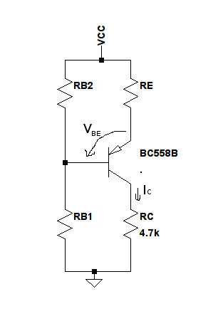

#Parte A) \underline{ETAPA AMPLIFICADORA CON UN TRANSISTOR}

Consigna:

> ***Obtenga una configuración que brinde $R_i > \SI{10}{\kilo\ohm}$, $A_v = \pm\SI{50}{\ohm}$ o lo más cercano posible. Trabajando con PNP.***

Viendo que se nos pide $A_v$ y $R_i$ elevados determinamos que nos conviene trabajar en modo emisor común.

Para tener $R_i$ elevado y mantener la amplificación estable a pesar de variaciones en $\beta$ decidimos tener una realimentación por emisor en señal.

Proponemos un circuito que en señal se vería como el siguiente:

{width=40%}

vemos que 

$$A_v = \frac{v_c}{v_b} = \frac{-g_m v_{be} R_C \parallel R_L}{v_b}= \frac{-g_m v_b \frac{r_\pi}{r_\pi+\beta R_E} (R_C \parallel R_L)}{v_b}=-\frac{g_m r_\pi (R_C \parallel R_L)}{r_\pi + \beta R_E} = -\frac{g_m (R_C \parallel R_L)}{1 + g_m R_E}$$

Y a la vez

$$ R_i = \frac{v_b}{i_b} = \frac{i_b R_\pi+i_e R_E}{i_b} = \frac{i_b(r_\pi + (\beta + 1)R_E)}{i_b} \sim r_\pi + \beta R_E $$

Con $I_{CQ} = \SI{1}{\milli \ampere}$ tenemos que $r_\pi= \frac{\beta V_T}{I_{CQ}}=\SI{7,5}{\kilo\ohm}$ así que con tener un $\beta R_E > \SI{2,5}{\kilo\ohm} \implies R_E > \frac{\SI{2,5}{\kilo\ohm}}{\beta}$ cumplimos la primera restricción.

Viendo la hoja de datos vemos que $\beta \sim 300$
$$R_E > \SI{8.33}{\ohm} $$

A la vez vemos de $A_v =- \frac{g_m (R_C \parallel R_L)}{1 + g_m R_E}$ que para tener un $|A_v|=50$ necestamos que $(R_C \parallel R_L)$ sea lo más grande posible para que pueda ser 50 veces más grande que $1 + g_m R_E$. 

Viendo los valores de capacidades disponibles en la placa nos quedamos con 
$$R_C=\SI{4.7}{\kilo\ohm}$$ 
y
$$R_L=\SI{10}{\kilo\ohm}$$

a la vez tenemos que $g_m=\frac{I_{CQ}}{V_T} = 0,04$ por lo que nos queda que 
$$|Av|=\frac{g_m(R_C \parallel R_L)}{1+g_m R_E} \implies R_E=\frac{(R_C \parallel R_L)}{50}-\frac{1}{g_m}=\SI{38,94}{\ohm}$$

Viendo la placa vimos que si bien no hay una resistencia tan baja hay la posibilidad de desacoplar parcialmente $R_E$ y utilizando un resistor externo. Decidimos hacer esto con un resistor de \SI{39}{\ohm} .

Esto nos deja con
$$R_i=\SI{19,2}{\kilo\ohm}$$

Pasamos a estudiar el circuito en continua.

{height=50%}

Con $I_{CQ}=\SI{1}{\milli\ampere}$ tenemos que $I_{BQ}=\frac{I_{CQ}}{\beta}=\SI{3,33}{\micro\ampere}$

Calculando los equivalentes de Thevenin de la red de polarización tengo que:

$$V_{B_{TH}}=V_{CC}\frac{R_{B2}}{R_{B1}+R_{B2}}$$
$$R_{B_{TH}}=\frac{R_{B1}R_{B2}}{R_{B1}+R_{B2}}$$

Viendo la malla de polarización:

$$V_{B_{TH}}-V_{CC}=I_{BQ} R_{B_{TH}}- V_{BE} +I_{EQ} R_E$$
$$V_{B_{TH}}-V_{CC}=I_{BQ} R_{B_{TH}}- V_{BE} +I_{EQ} R_E$$
$$V_{B_{TH}}-V_{CC}+V_{BE}=I_{BQ} R_{B_{TH}} +(\beta+1)I_{BQ} R_E$$
$$V_{CC}\bigg(\frac{R_{B2}}{R_{B1}+R_{B2}}-1\bigg)=I_{BQ}\bigg(\frac{R_{B1}R_{B2}}{R_{B1}+R_{B2}} +(\beta+1)R_E\bigg)-V_{BE}$$

Reemplazando los valores de $I_{CQ}$, $\beta$ y $V_{BE}$ y tomando $R_E=\SI{1}{\kilo\ohm}$ por ser el más alto y darnos mayor estabilidad llegamos a:

$$V_{CC}=\frac{R_{B1}+R_{B2}}{-R_{B2}} \Bigg(\SI{3,33}{\micro\ampere} \big(\frac{R_{B1}R_{B2}}{R_{B1}+R_{B2}} +\SI{301}{\kilo\ohm})-\SI{0.7}{\volt}\Bigg)$$

