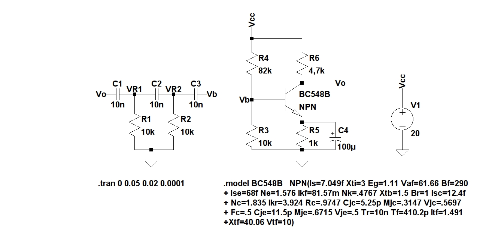
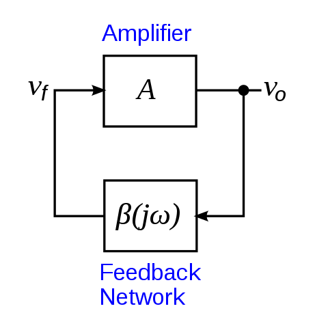

\pagebreak

#D) Oscilador senoidal por desplazamiento de fase

A partir de un transistor TBJ NPN, polarizado como se indica en la figura y conectado a la red RC
indicada se analizarán diversos aspectos de su funcionamiento.

\hfill

## Periodicidad de la señal $v_o$

El uso de realimentación positiva que dé por resultado un amplificador con ganancia en lazo
cerrado $|A_f| > 1$ y que satisfaga las condiciones de fase hará que funcione como un circuito oscilador. Éste produce entonces una se señal de salida variable, y si dicha señal varía senoidalmente, el circuito se conoce como oscilador senoidal.

Supongamos que a lazo abierto se tienen dos amplificadores $\alpha$ (amplificador básico) y $\beta$ (red de realimentación) de ganancia homónima. Suponiendo una señal ficticia de entrada $v_i$,
la primer etapa arrojará $\alpha v_i$, que a su vez servirá de entrada a la segunda etapa y la salida
será $v_o = \beta\alpha v_i$. Donde $\beta\alpha$ se conoce como ganancia de lazo.

Si los circuitos otorgan una $\beta\alpha$ de magnitud y fase correctas, $v_o \sim v_i$ . Entonces, cuando se esté en lazo cerrado y sin el efecto de $v_i$, el circuito continuará operando puesto que la tensión de realimentación es suficiente para controlar los circuitos del amplificador y de realimentación, y de esta manera se obtiene una tensión de entrada apropiada para mantener la operación del lazo. Si se satisface la condición, la forma de onda de salida seguirá existiendo después de que se cierre el lazo (criterio de oscilación de Barkhausen: $\beta\alpha$ = 1).

{width=40%}

\hfill

En realidad no se requiere señal alguna de entrada para hacer funcionar el oscilador. Sólo
se debe satisfacer el criterio mencionado para tener oscilaciones autosostenidas. Aunque en la
práctica este valor suele ser mayor a 1, los valores de saturación en el circuito real proporcionan
un valor cercano a 1. Las formas de onda obtenidas nunca son exactamente senoidales, pero
mientras mas se acerca $\beta\alpha$ a 1, más senoidal es la forma de onda.

## Relación de frecuencia de $v_o$ con la red RC

## Uso del oscilador en bajas frecuencias

## Frecuencia $V_{cc}$ mínima de oscilación