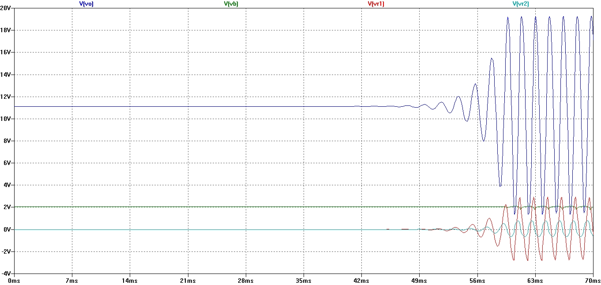
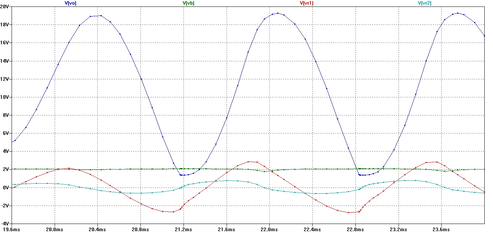
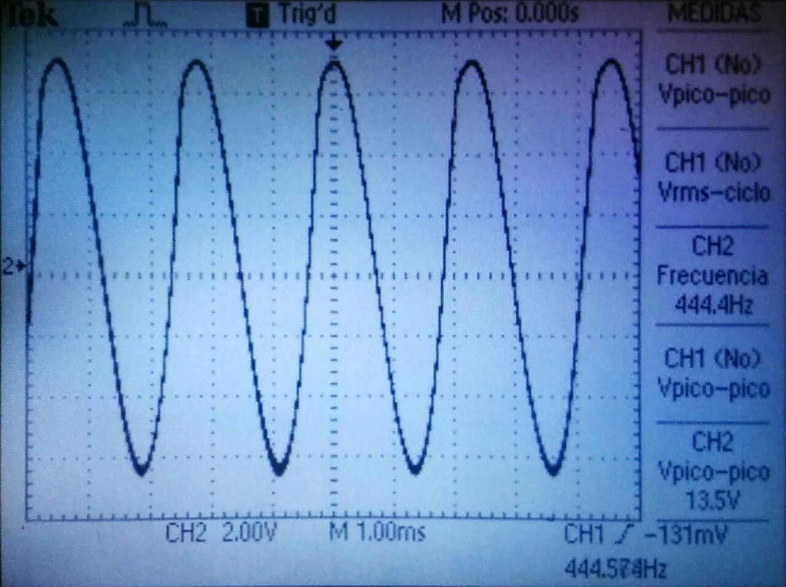

\pagebreak

#D) OSCILADOR SENOIDAL POR DESPLAZAMIENTO DE FASE

A partir de un transistor TBJ NPN, polarizado como se indica en la figura y conectado a la red RC
indicada se analizarán diversos aspectos de su funcionamiento.

\hfill

## Periodicidad de la señal $v_o$

El uso de realimentación positiva que dé por resultado un amplificador con ganancia en lazo
cerrado $|A_f| > 1$ y que satisfaga las condiciones de fase hará que funcione como un circuito oscilador. Éste produce entonces una se señal de salida variable, y si dicha señal varía senoidalmente, el circuito se conoce como oscilador senoidal.

Supongamos que a lazo abierto se tienen dos amplificadores $\alpha$ (amplificador básico) y $\beta$ (red de realimentación) de ganancia homónima. Suponiendo una señal ficticia de entrada $v_i$,
la primer etapa arrojará $\alpha v_i$, que a su vez servirá de entrada a la segunda etapa y la salida
será $v_o = \beta\alpha v_i$. Donde $\beta\alpha$ se conoce como ganancia de lazo.

Si los circuitos otorgan una $\beta\alpha$ de magnitud y fase correctas, $v_o \sim v_i$ . Entonces, cuando se esté en lazo cerrado y sin el efecto de $v_i$, el circuito continuará operando puesto que la tensión de realimentación es suficiente para controlar los circuitos del amplificador y de realimentación, y de esta manera se obtiene una tensión de entrada apropiada para mantener la operación del lazo. Si se satisface la condición, la forma de onda de salida seguirá existiendo después de que se cierre el lazo (criterio de oscilación de Barkhausen: $\beta\alpha$ = 1).

{width=40%}

\hfill

En realidad no se requiere señal alguna de entrada para hacer funcionar el oscilador. Sólo
se debe satisfacer el criterio mencionado para tener oscilaciones autosostenidas. Aunque en la
práctica este valor suele ser mayor a 1, los valores de saturación en el circuito real proporcionan
un valor cercano a 1. Las formas de onda obtenidas nunca son exactamente senoidales, pero
mientras mas se acerca $\beta\alpha$ a 1, más senoidal es la forma de onda.

## Relación de frecuencia de $v_o$ con la red RC

Si se utiliza un transistor como el elemento activo de la etapa del amplificador, la salida de la red de realimentación se carga de manera apreciable por la resistencia de entrada relativamente baja ($h_{ie}$) del transistor. En esta conexión, $\beta = \frac{1}{29}$ y $\alpha > 29$ para cumplir el criterio de Nyquist (desfasaje de 180 y magnitud 1).
Cada uno de los 3 circuitos RC en el lazo de realimentación es capaz de producir un desfazaje máximo de 90°. La oscilación ocurre a la frecuencia donde el desfazaje total a través de los 3 circuitos RC es de 180°.
Por otro lado el amplificador mismo aporta los 180° adicionales para satisfacer el requerimiento para la oscilación de un desfasaje de 360° alrededor del lazo de realimentación.

Se encuentra que la frecuencia es aproximadamente:

$$\displaystyle f = \frac{1}{2 \pi RC \sqrt{6 + 4 \frac{R_C}{R}}} \sim \frac{1}{2 \pi RC \sqrt{6}}$$
$$\displaystyle f = \frac{1}{2 \pi (\SI{10}{\kilo\ohm})(\SI{10}{\nano\farad}) \sqrt{6}} = \SI{649,75}{\hertz} \sim \SI{650}{\hertz}$$

## Frecuencia de oscilación

Se visualiza que el período es $T = \SI{1,7}{\milli\second}$ y por lo tanto $f \sim \SI{625}{\hertz}$, con un error menor del 10% cercano a los 650Hz predichos teóricamente.

\hfill

{width=100%}

\hfill

{width=100%}

\hfill

Esto se debe a que el circuito RC en cuestión está formado por el capacitor C3 (ver esquema) próximo a la entrada del transitor y la resistencia de entrada del amplificador que, para simplificar,
supusimos de un valor similar al de las demás resistencias. Siendo que la diferencia entre el
valor teórico y el simulado es pequeña, podemos afirmar a posteriori que la suposición es bastante aproximada.

## Uso del oscilador en bajas frecuencias

En las mediciones se encuentra una frecuencia de oscilación de $f \sim \SI{444}{\hertz}$. Ambos
resultados corresponden a bajas frecuencias y las discrepancias se deben seguramente a las
aproximaciones realizadas a la hora de calcular la frecuencia teórica.

\hfill

{width=60%}

\hfill

La frecuencia de oscilación es impuesta por los parámetros de la red de realimentación. Los
mismos tienen parámetros $\tau$ bastante altos, lo que impone una frecuencia de funcionamiento
baja.
